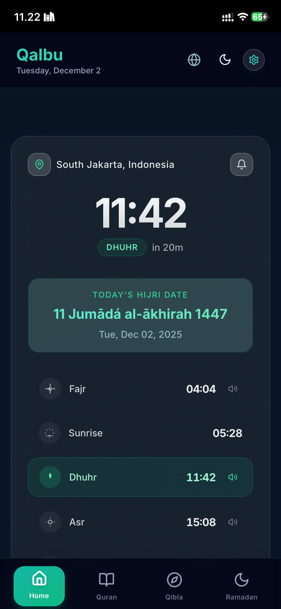
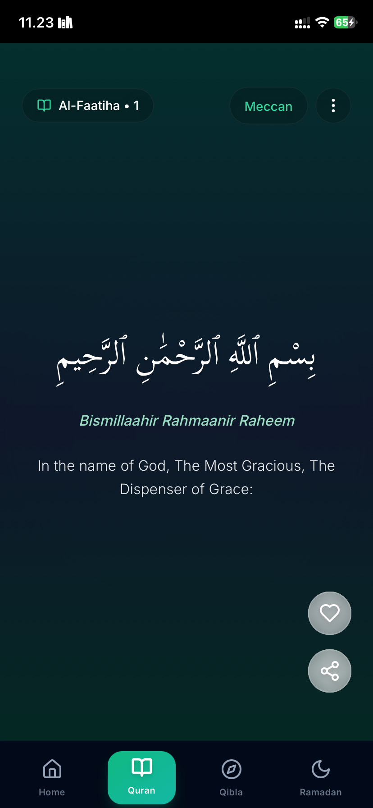
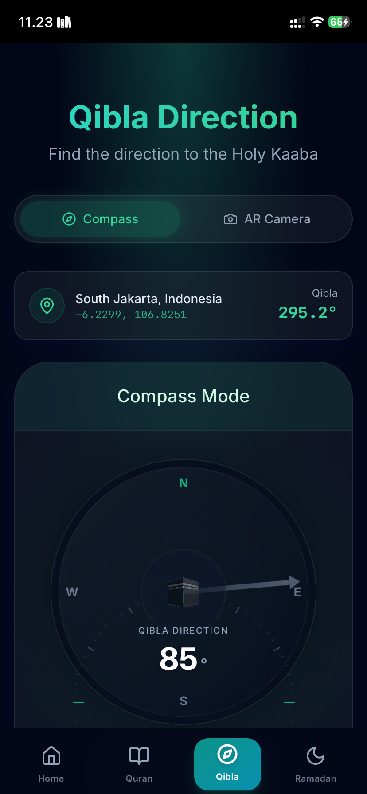
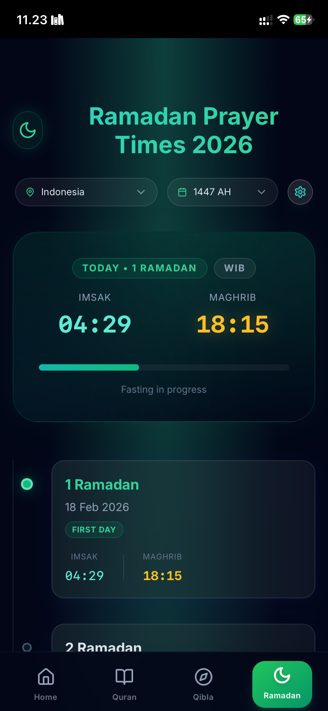

<div align="center">
  

  <h1 style="font-size: 3rem; margin-top: 1rem; margin-bottom: 0.5rem;">Qalbu</h1>
  
  <p style="font-size: 1.25rem; color: #64748b; margin-bottom: 2rem;">
    <em>Your Modern, Elegant Islamic Companion</em>
  </p>

  <div style="display: flex; gap: 0.5rem; justify-content: center; margin-bottom: 2rem;">
    
    
    
    
    
  </div>
</div>

---

## Why Qalbu?

**Qalbu** (Heart) is designed to be more than just a utility app. It's a spiritual companion built with a focus on **beauty**, **serenity**, and **modern user experience**. 

We believe that interacting with your faith should be a delightful experience. That's why we've crafted every pixel to feel premium, using glass-morphism, smooth animations, and a calming color palette inspired by Islamic art and nature.

---

## Gallery

| Home | Quran | Qibla | Ramadan |
| :---: | :---: | :---: | :---: |
|  |  |  |  |

---

## Key Features

### Prayer & Worship
- **Smart Prayer Times**: Auto-detected location with accurate timings from Aladhan API.
- **Next Prayer Countdown**: Beautiful countdown timer to help you prepare.
- **Hijri Calendar**: Integrated Islamic calendar.
- **Qibla Finder**: 
  - **Compass Mode**: Smooth, accurate digital compass.
  - **AR Mode**: Augmented Reality camera overlay to visualize the Qibla in the real world.

### The Holy Quran
- **Complete Quran**: All 114 Surahs with clear, beautiful Arabic typography (*Scheherazade New*).
- **Quran Reels**: An immersive, TikTok-style vertical scrolling experience for reading and listening.
- **Audio Recitations**: 
  - Crystal clear audio from world-renowned reciters.
  - **Multiple Reciters**: Choose your favorite voice (Mishary Alafasy, and more).
  - **Background Playback**: Listen while using other apps or with the screen off.
- **Share Ayah**: Generate beautiful, watermarked images of Ayahs to share on social media.
- **Transliteration & Translation**: Toggleable English translation and Latin transliteration.

### Design & Experience
- **Premium Aesthetic**: "Modern Spiritual" theme with Teal/Navy gradients and glass effects.
- **PWA Support**: Installable on iOS and Android for a native app-like experience.
- **Offline Capable**: Works even when you lose internet connection.
- **Smooth Animations**: Powered by Framer Motion for a fluid feel.

---

## Tech Stack

Built with the latest and greatest web technologies for performance and developer experience.

| Category | Technology | Description |
|----------|-----------|-------------|
| **Framework** | [Next.js 15](https://nextjs.org/) | App Router, Server Components |
| **Language** | [TypeScript 5.7](https://www.typescriptlang.org/) | Type safety and developer experience |
| **Styling** | [TailwindCSS 3.4](https://tailwindcss.com/) | Utility-first CSS |
| **UI Library** | [shadcn/ui](https://ui.shadcn.com/) | Reusable, accessible components |
| **Animations** | [Framer Motion](https://www.framer.com/motion/) | Production-ready animation library |
| **State** | [Zustand](https://github.com/pmndrs/zustand) | Minimalist state management |
| **Data** | [TanStack Query](https://tanstack.com/query) | Async state management |
| **Testing** | [Vitest](https://vitest.dev/) | Blazing fast unit testing |

---

## Roadmap

We are constantly improving Qalbu. Here's what we've done and what's coming next:

- [x] **Core Features** (Prayer Times, Quran, Qibla)
- [x] **PWA Support** (Installable, Offline)
- [x] **Unit Testing** (Home Components, Audio Context)
- [x] **Language Support** (English/Indonesian Switcher)
- [x] **Multiple Reciters** (API Integration)
- [x] **Social Sharing** (Beautiful Ayah Images)
- [ ] **Tafsir Integration** (Deep dive into meanings)
- [ ] **Bookmarks & History** (Save your progress)
- [x] **Dua Collection** (Daily supplications)
- [ ] **Digital Tasbih** (Counter)
- [ ] **Push Notifications** (Adhan alerts)

---

## Getting Started

### Prerequisites
- Node.js 18+
- npm, pnpm, or yarn

### Installation

1. **Clone the repo**
   ```bash
   git clone https://github.com/yourusername/qalbu.git
   cd qalbu
   ```

2. **Install dependencies**
   ```bash
   npm install
   ```

3. **Run the dev server**
   ```bash
   npm run dev
   ```

4. **Open your browser**
   Visit `http://localhost:3000` to see the app in action.

---

## Running Tests

Ensure code quality with our comprehensive test suite.

```bash
# Run unit tests
npm run test

# Generate coverage report
npm run test:coverage
```

---

## License

This project is open source and available under the [MIT License](LICENSE).

---

<div align="center">
  <p>Made with ❤️ for the Ummah</p>
  <p><strong>Qalbu Team</strong></p>
</div>
